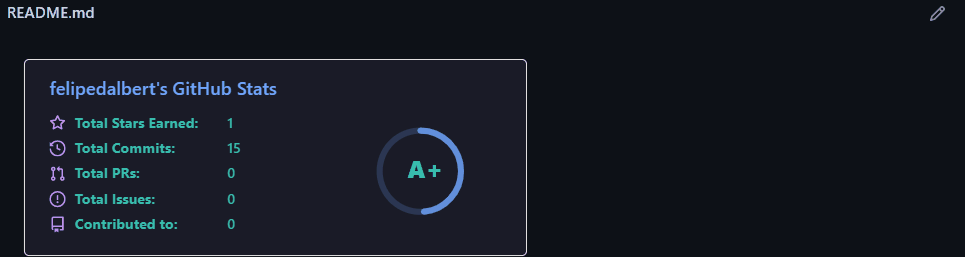

# Project with README

Project test containing a README file 🚀 



## Technologies used
- HTML
- CSS

## How to use?

1 - Project clone
```
git clone <url>
```
2 - Access the project folder
```
cd repository-with-readme
```